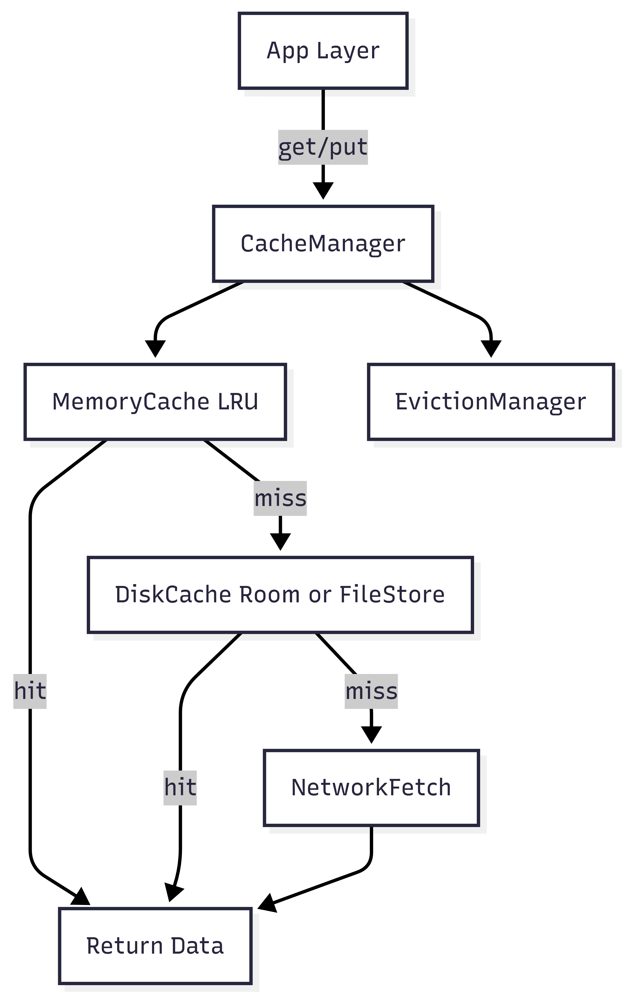

# Android Caching Library Design

## 1. Problem Statement

Build a caching library for Android that stores API/network responses locally to reduce redundant network calls, support offline access, and improve app performance.

---

## 2. Requirements

### Functional Requirements:
- Store and retrieve data associated with network responses.
- Provide multiple cache strategies (e.g., memory-only, disk-only, both).
- Support TTL (Time-To-Live) and cache invalidation.
- Support manual cache clearing per key and globally.
- Provide cache hit/miss statistics for logging/debugging.
- Allow developers to plug in custom serializers (e.g., Moshi, Gson).
- Thread-safe and lifecycle-aware design.
- Eviction strategies (LRU, size-based, expiry-based).

### Non-Functional Requirements:
- Minimal impact on app startup and runtime performance.
- Easy to integrate and use.
- Background cache cleanup.
- Secure storage options (optional, for sensitive data).
- Coroutine and suspend support.

---

## 3. Core API Interface

```kotlin
interface Cache {
    suspend fun <T> get(key: String, type: Class<T>): T?
    suspend fun <T> put(key: String, value: T, ttl: Long? = null)
    suspend fun remove(key: String)
    suspend fun clearAll()
}
````

---

## 4. Architectural Overview


```

---

## 5. Layers and Components

### 1. CacheManager

* Unified access layer combining memory & disk
* Implements the `Cache` interface
* Selects caching strategy based on configuration

### 2. MemoryCache (LRU)

* Stores limited size in-memory cache
* Eviction handled by `LinkedHashMap` or `LruCache`
* Fastest access

### 3. DiskCache

* Stores serialized responses to disk
* Uses Room DB or File I/O
* TTL & expiration metadata stored separately

### 4. JournalStore

* Tracks keys, TTLs, timestamps
* Responsible for expiry checks and background cleanup
* Implemented via SQLite/Room or SharedPreferences

### 5. EvictionManager

* Periodically checks for expired entries
* Can use `WorkManager` or internal coroutine job
* Clears expired/least-recently-used data

---

## 6. Sample Usage

```kotlin
val config = CacheConfig(
    memorySizeMb = 10,
    diskSizeMb = 50,
    defaultTtl = 5 * 60 * 1000L // 5 mins
)

val cache = CacheManager(context, config)

suspend fun fetchUserProfile(userId: String): UserProfile {
    val key = "user_profile_$userId"
    cache.get<UserProfile>(key)?.let {
        return it // cache hit
    }

    val response = api.fetchUser(userId) // API call
    cache.put(key, response)
    return response
}
```

---

## 7. CacheConfig

```kotlin
data class CacheConfig(
    val memorySizeMb: Int = 10,
    val diskSizeMb: Int = 50,
    val defaultTtl: Long = 5 * 60 * 1000, // 5 min
    val strategy: CacheStrategy = CacheStrategy.MEMORY_AND_DISK,
    val serializer: Serializer = MoshiSerializer()
)
```

---

## 8. Cache Strategies

```kotlin
enum class CacheStrategy {
    MEMORY_ONLY,
    DISK_ONLY,
    MEMORY_AND_DISK
}
```

---

## 9. Serializer Abstraction

```kotlin
interface Serializer {
    fun <T> toJson(obj: T): String
    fun <T> fromJson(json: String, type: Class<T>): T
}
```

---

## 10. Eviction Policies

* **Memory LRU**: Size-based eviction.
* **Disk Expiry**: TTL or last-access time tracked.
* **Manual Clear**: Developer-triggered clear for specific key or all.
* **Auto Cleanup**: Background job using `WorkManager` or coroutine.

---

## 11. Tricky Cases

### ❓ What happens on app kill and reopen?

* Memory cache lost.
* Disk cache and TTL checked via JournalStore.

### ❓ Large API responses?

* Serialize + compress on disk (e.g., GZIP).
* Evict older entries if disk space is low.

### ❓ What if cache is stale but request fails?

* Fallback to stale disk cache (configurable).

---

## 12. Extension Ideas

* Add encryption for disk cache using Jetpack Security.
* Add cache prefetch APIs.
* Allow tagging cache entries (e.g., "user", "feed").
* Network interceptor support for auto-caching API calls.

---

## 13. Summary

The Caching Library is modular, efficient, and extensible, designed to balance performance and reliability. It provides developers control over caching behavior while abstracting away boilerplate logic.

```
